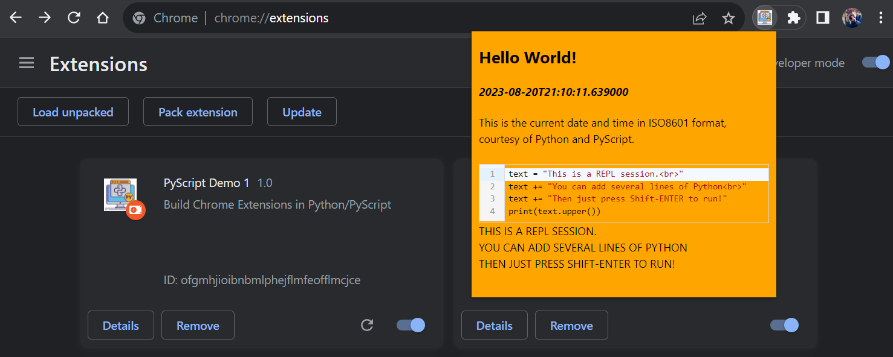

# pyscript-local-runtime

This repository provides a framework for running PyScript and all its runtime dependencies locally e.g. to create a Chrome extension using Python, or an offline web app using PyScript without relying on internet access.

PyScript and its dependency Pyodide continue to evolve but this demo is frozen at Pyodide v0.21.3. You're strongly advised to check out the [latest version of PyScript](https://pyscript.net/) and there are numerous PyScript tutorials online for learning more about its capabilities - that's not the focus of this Demo!

All the files you need to run PyScript (at v0.21.3) are in the `/runtime` directory and you can also download them on POSIX using wget...
   ```shell
   cd runtime
   source setup.sh
   ```

or on Windows using the helper script supplied:
   ```
   cd runtime
   python setup.py
   ```

## **EXAMPLE CHROME EXTENSION**


This example Chrome Extension launches a Popup when clicked, renders the time using Python's `datetime` module, and provides a Python REPL session for you to play with directly inside the extension.

To use this extension directly, first clone it to your local machine then
[follow this tutorial](https://medium.com/p/6c6b0e2e1573) to load the unpacked extension into Chrome and pin it to your Extensions toolbar.

* Icons are in the `/icons` folder.
* PyScript/Pyodide files to run this offline or as part of an extension are in the `/runtime` folder.
* Other magic required for Chrome to recognise this as an extension is in `manifest.json`.
* `popup.css` is an incredibly simple Cascading Style Sheet which defines the appearance of the Popup - in this case simply the width, height, and background colour.
* `popup.html` defines the page content of the Popup. It includes some simple boiler-plate HTML as well as some examples of Python code which runs under the tags `<py-script>` and/or `<py-repl>`.
* `popup.html` must include a `<py-config>` block as follows:

   ```html
   <py-config>
         [[runtimes]]
         src = "runtime/pyodide.js"
         name = "pyodide-0.21.3"
         lang = "python"
   </py-config>
   ```

* `popup.html` must include also include two lines to load PyScript and its default stylesheet into the extension:

   ```html
   <link rel="stylesheet" href="runtime/pyscript.css" />
   <script defer src="runtime/pyscript.js"></script>
   ```

Further information about getting started with Chrome Extensions is available [here](https://developer.chrome.com/docs/extensions/mv3/getstarted/).

All the best,
Pete

https://github.com/PFython

## **CREDITS**

A big "Thank You" to https://github.com/tedpatrick (Engineering Manager at Anaconda) for pointing me in the right direction.

If this code helps you save time and focus on more important things, please feel free to to show your appreciation by starring the repository on Github.

I'd also be delighted if you wanted to:

<a href="https://www.buymeacoffee.com/pfython" target="_blank"></a>

